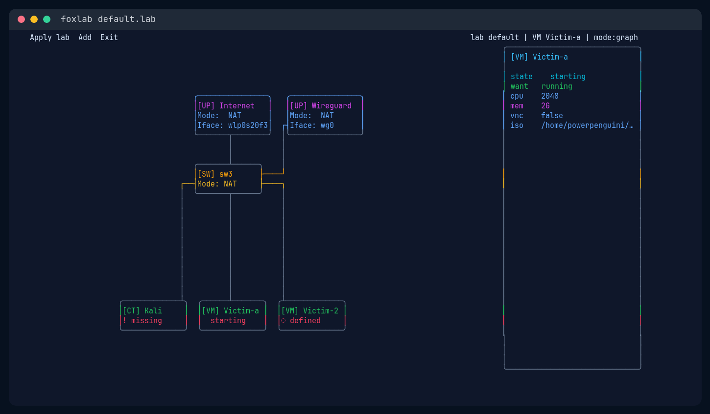

# FoxLab CLI

FoxLab CLI is a terminal topology app and runtime helper for editing `.lab`
network labs and converging VM/container workloads through libvirt and
containerd backends.

## Showcase



The showcase image is captured from the current default lab:

```sh
GOCACHE=/tmp/foxlab-cli-go-build GOPROXY=off go run ./cmd/foxlab --no-raw --width 140 --height 36
```

## Usage

Open the default lab:

```sh
foxlab
```

Open a lab file:

```sh
foxlab --lab path/to/topology.lab
```

Run one non-interactive frame for smoke checks:

```sh
foxlab --no-raw --width 140 --height 36
```
