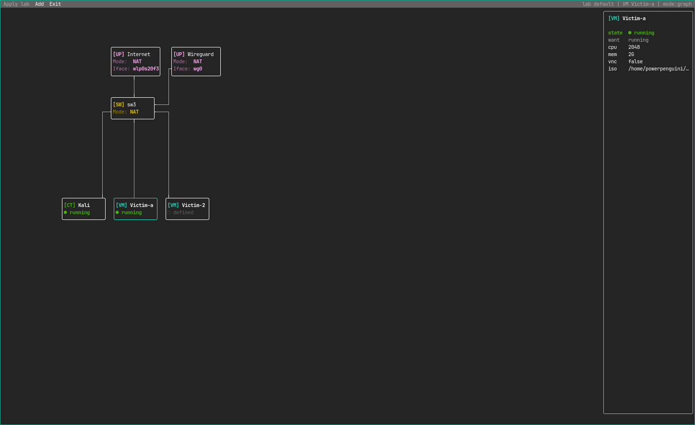

# FoxLab CLI

FoxLab CLI is a terminal topology app and runtime helper for editing `.lab`
network labs and converging VM/container workloads through libvirt and
containerd backends.

## Showcase



The showcase image is a real terminal screenshot of an interactive `foxlab`
session opened on the default lab at `~/.foxlab/default.lab`.
Render the same lab as one non-interactive smoke frame with:

```sh
GOCACHE=/tmp/foxlab-cli-go-build GOPROXY=off go run ./cmd/foxlab --no-raw --width 140 --height 36
```

## Usage

Open the default lab:

```sh
foxlab
```

Open a lab file:

```sh
foxlab --lab path/to/topology.lab
```

Run one non-interactive frame for smoke checks:

```sh
foxlab --no-raw --width 140 --height 36
```

## Lab identifiers

Node identifiers in `.lab` files are mnemonic names used by references throughout
the topology. They must start with a letter or number and contain only letters,
numbers, `_`, or `-`. UUID node identifiers are not supported.

```yaml
name: demo
vms:
  - id: victim-a
    memoryMB: 2048
    cpus: 2
    disk: ""
    networks:
      - switch: lan
containers:
  - id: kali
    image: docker.io/kalilinux/kali-rolling:latest
    networks:
      - switch: lan
switches:
  - id: lan
    mode: bridge
```

The optional node `name` is only a display alias. Creating or renaming a node
through FoxLab uses the supplied mnemonic value as its durable `id`; a rename
therefore updates references and recreates the corresponding runtime resource.
